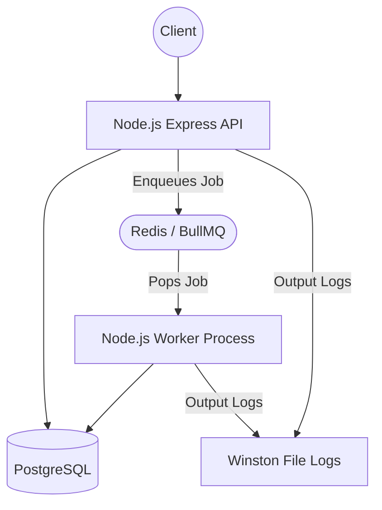

## 🏗 System Architecture

The application is built using a decoupled **Producer-Consumer** architecture to ensure the API remains fast and responsive while heavy tasks (like sending emails or batch-updating customers) are processed asynchronously in the background.



### Components
1. **Express API (Producer)**: Handles incoming HTTP requests, validates payloads using Joi, performs database mutations, and enqueues background jobs into Redis. Returns HTTP 20X responses immediately.
2. **PostgreSQL Database**: The source of truth for `customers`, `events`, and `bookings`.
3. **Redis & BullMQ (Message Broker)**: Acts as the middleman queue. It securely holds jobs (like "Send Booking Email") until a worker is ready to process them.
4. **Worker (Consumer)**: A separate Node.js process running constantly in the background. It listens to Redis queues, picks up jobs, executes the heavy lifting (e.g., fetching 1,000 customers from the DB to send notifications), and logs the completion.
5. **Winston Logger**: Both the API and Worker stream their logs asynchronously to daily rotating log files in the `/logs` directory, preventing the application from blocking during heavy I/O.

---

## 🔐 Role-Based Access Control (RBAC)

The API is secured using JSON Web Tokens (JWT). There are two types of users:
*   **Customer**: Can browse events and book tickets (`POST /api/bookings`).
*   **Organizer**: Can manage and update events (`PUT /api/events/:id`).

*Note: For testing purposes, there is a dummy token generation endpoint.*

---

## 🚀 How to Run Locally

### Prerequisites
*   Docker & Docker Compose
*   Node.js (v18+)

### 1. Start the Infrastructure
Start PostgreSQL and Redis in the background using Docker:
```bash
docker-compose up -d
```

### 2. Install Dependencies
```bash
npm install
```

### 3. Start the Application
You will need two terminal windows.

**Terminal 1 (Start the API Server):**
```bash
npm run dev
```

**Terminal 2 (Start the Background Worker):**
```bash
npm run dev:worker
```

---

## 🧪 Testing the API

### 1. Get Authentication Tokens
Tokens expire in 1 hour.
```bash
# Get a Customer Token
curl -s "http://localhost:3000/api/auth/token?userId=1&role=customer"

# Get an Organizer Token
curl -s "http://localhost:3000/api/auth/token?userId=2&role=organizer"
```

### 2. Book a Ticket (Customer Only)
Replace `<CUSTOMER_TOKEN>` with the token from Step 1.
```bash
curl -X POST http://localhost:3000/api/bookings \
  -H "Content-Type: application/json" \
  -H "Authorization: Bearer <CUSTOMER_TOKEN>" \
  -d '{
    "customer_id": 1,
    "event_id": 1,
    "seats": 2
  }'
```

### 3. Update an Event (Organizer Only)
Replace `<ORGANIZER_TOKEN>` with the token from Step 1.
```bash
curl -X PUT http://localhost:3000/api/events/1 \
  -H "Content-Type: application/json" \
  -H "Authorization: Bearer <ORGANIZER_TOKEN>" \
  -d '{
    "name": "Super Mega Festival",
    "date": "2026-10-31T18:00:00Z",
    "location": "Main Stage"
  }'
```

### 4. Check the Worker Logs
You can see the output of the background jobs (Emails and Notifications) directly in the terminal where your worker is running, or by checking the auto-generated log files:
```bash
cat logs/application-*.log
```


